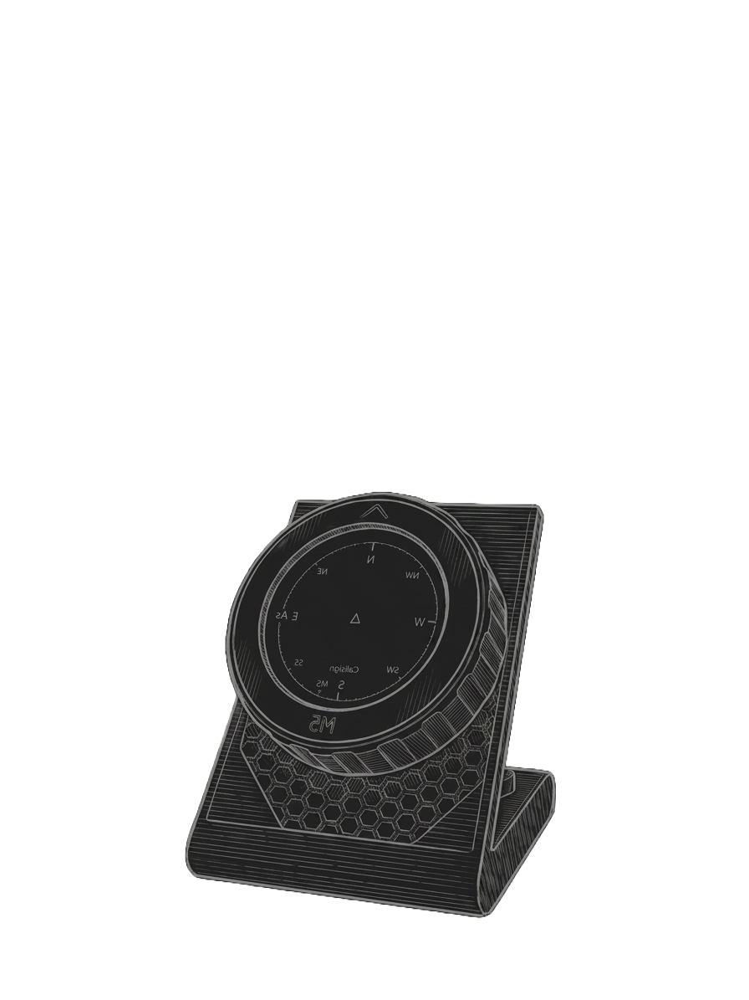

  

# M5 Flight Dial

m5flight_dial is a real-time flight tracking radar built specifically for the M5Stack M5Dial using MicroPython.

It operates by fetching live aircraft data from Flightradar24, calculating each aircraft's distance and bearing relative to your exact location, then plotting them on a custom circular compass-style display.

This project was based off Sebwap's [M5Dial_FlightRadar](https://github.com/Sebwap/M5Dial_FlightRadar), remaking it into a polished, hardened version featuring a compass-style display, its own rotary-encoder class, and try/except error handling throughout.

STL files for a stand are included in the [`stl/`](stl) directory.

## Requirements

- M5Stack M5Dial
- UIFlow2.0 firmware (flashed via M5Burner)
- Wi-Fi connection
- A Chrome browser (for the UIFlow2.0 web IDE)

## Getting Started

1. Download and install [M5Burner](https://docs.m5stack.com/en/uiflow/m5burner/intro)
2. Press and **hold** the BTN / Download Mode button on the back of the M5Dial while connecting via USB
3. Download, configure and flash **UIFlow2.0** to the M5Dial
4. After flashing, reset the device via the reset button on the back panel
5. Open your Chrome browser and navigate to [uiflow2.m5stack.com](https://uiflow2.m5stack.com/)
6. Paste the `main.py` script on the Python tab (you can also direct upload it)
7. Open the Webterminal by clicking the bottom-left icon and select your device
8. Check for shown errors — if none are present, proceed by clicking the **Download** button
9. Edit your `secrets.py` on your machine, then upload it to the `flash` directory by clicking the **FILE** tab
10. Reboot the device

## Setting Parameters (secrets.py)

| Parameter | Required | Default | Description |
|---|---|---|---|
| `WIFI_SSID` | Yes | *(none)* | Your Wi-Fi network name. The M5Dial only supports 2.4 GHz networks. |
| `WIFI_PASSWORD` | Yes | *(none)* | Your Wi-Fi network password. |
| `LATITUDE` | Yes | *(none)* | Your exact latitude in decimal degrees, e.g. `39.0917`. Used as the center of the radar. |
| `LONGITUDE` | Yes | *(none)* | Your exact longitude in decimal degrees, e.g. `-9.2586`. Used as the center of the radar. |

## Stand

STL files for a printable desk stand are included in the [`stl/`](stl) directory. No supports required; print in the orientation provided.

## Author

Developed by **MIL / VUS Works** — <https://milvusworks.com>

## Disclaimer

This is an independent, unofficial project. It is not affiliated with,
endorsed by, or sponsored by Flightradar24 AB or M5Stack Technology Co., Ltd.
Flightradar24 is a registered trademark of Flightradar24 AB. M5Stack, M5Dial
and UIFlow are trademarks of M5Stack Technology Co., Ltd. This project
consumes publicly reachable Flightradar24 feed data and is not a
Flightradar24 product. All other trademarks are the property of their
respective owners and are used here for identification purposes only.

This software is provided "AS IS", without warranty of any kind. You are
responsible for complying with the Flightradar24 terms of service and any
applicable licenses when using this tool.
